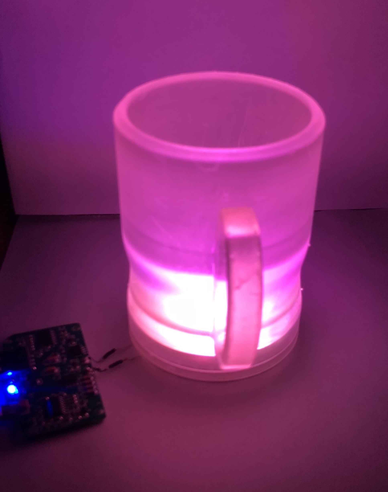

# Glowing Cup

## Summary
The board measures the temperature and adjusts the color accordingly.
The Temperature is determined by three sensors, which provides the mean value
to the microcontroller. It processes and visualizes the data as a color via the built-in RGB LEDs. The board is charged wirelessly using Qi(pronounced CHEE) technology.

## Pictures
|                                    |                                |
| ---------------------              | ---------------------          |
|     |  |
|  |  |

